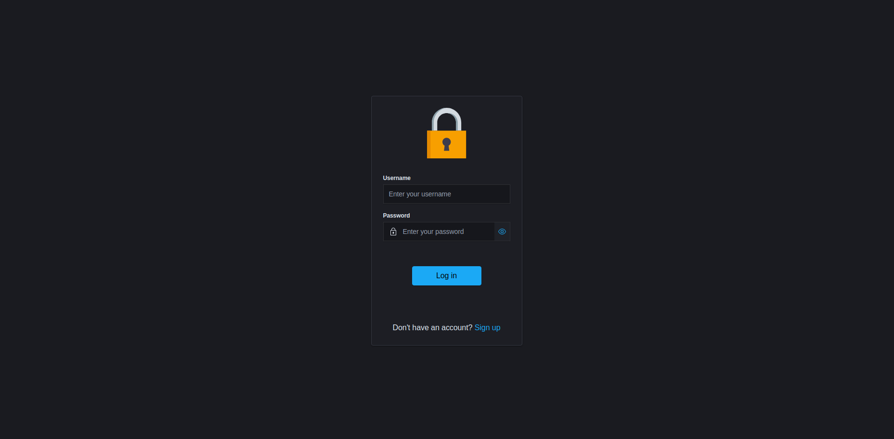
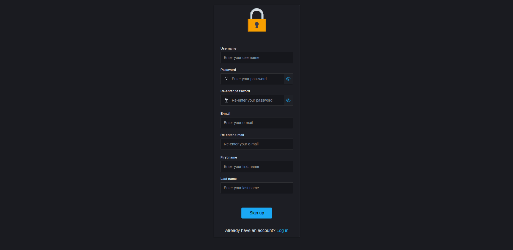
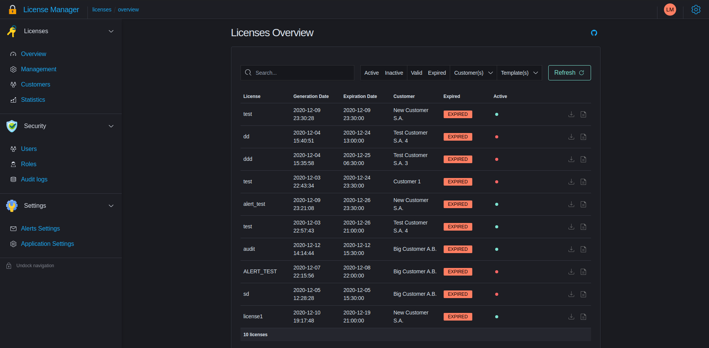
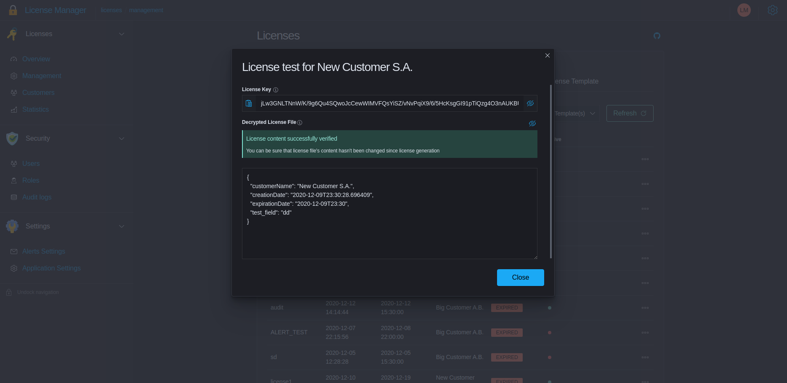
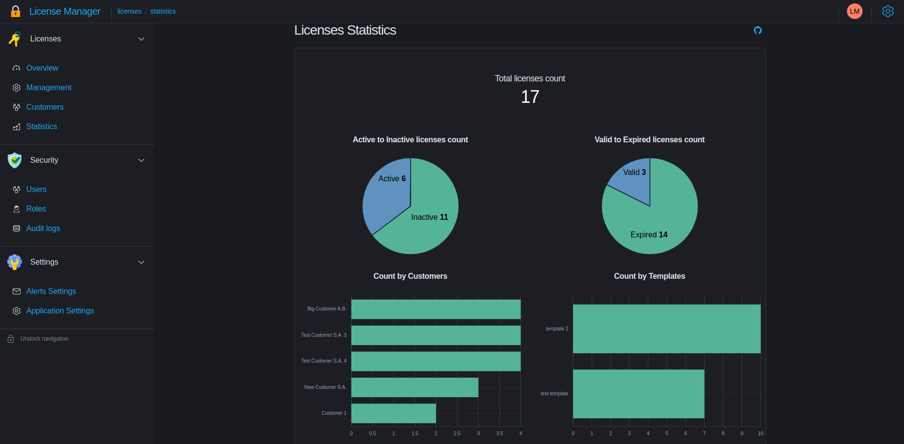
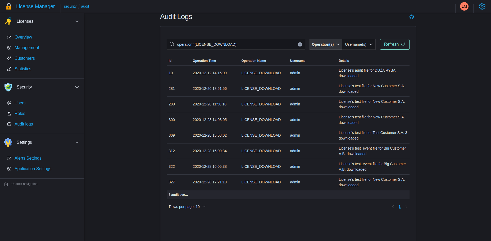
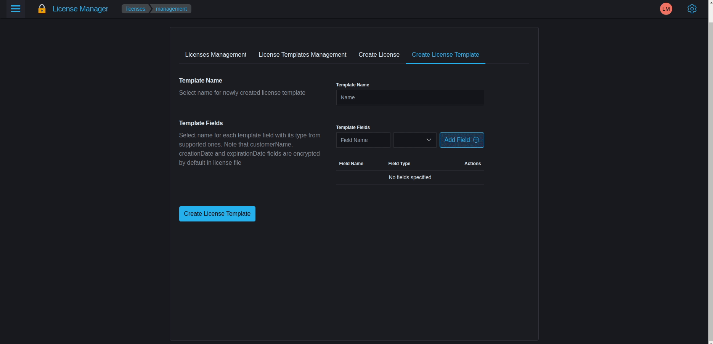
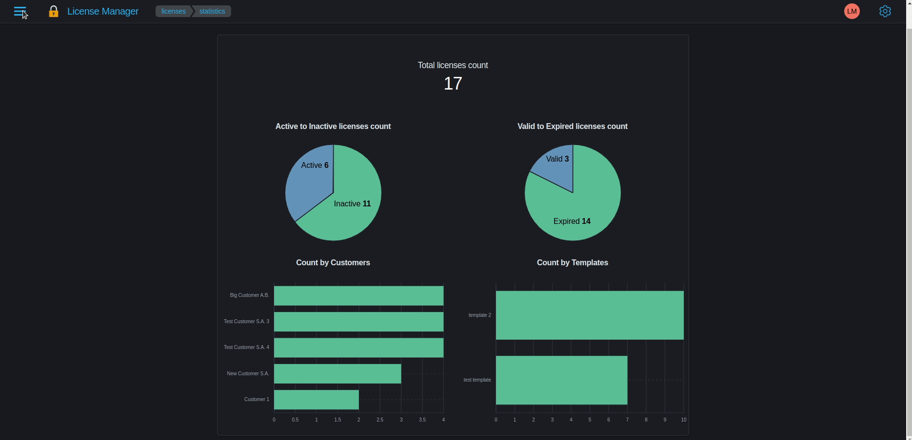
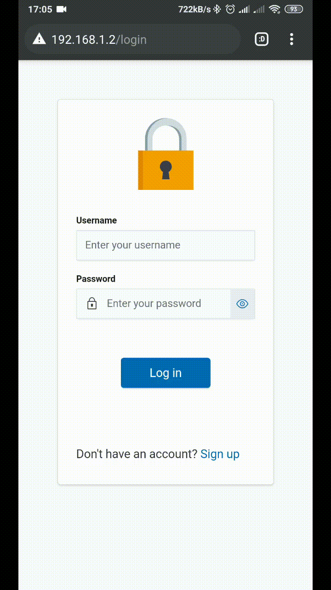

# LicenseManager-frontend       


License Manager is a web application for managing clients' licenses. \
License Manager allows to create cross platform licenses for company's software products in a generic and suitable way. \
Everything is based on license templates, which creation is unlocked for users with administration rights in system. \
License templates are powerfull way of defining properties encrypted in license file. \
Resulting license file is created as encrypted serializable JSON object with properties defined in assigned template.

## Features overview

- Asymmetric RSA encryption used for generating file's digital signature
- Symmetric AES encryption with key created as variation of selected template's public RSA key
- Extending license's expiration date
- Browsing audit events available for admin users,
- Receiving e-mail alerts about licenses expiration date,
- Receiving e-mails about operations made by users in system for admin users,
- Browsing license's details such as license key and encrypted license's content

## Getting started

1. Setting up SSL certificate for frontend

- You can use either provided self-signed certificate placed in [SSL](./frontend/ssl/) directory, which is pretty the same certificate as for backend, generate your own SSL certificate using OpenSSL tool or purchase your own SSL certificate from CA authority.

Corresponding certificate's files should be placed in [SSL](./frontend/ssl) directory.

2. Setting up Docker environment

To run production build of application with Nginx server through HTTPS in containerized
environment using docker-compose tool just navigate into project directory and run following command in your terminal

```
docker-compose --project-name license-manager up
```

Note that if you decided to use the same project name as for backend services, docker-compose will warn you about orphan containers, just ignore this warning, because backend services containers should still running.

You can also pass explicitly docker-compose config file by passing `-f/--file` argument followed by path to config file

```
docker-compose --project-name license-manager -f docker-compose.yaml up
```

To run containers in "detached" mode just add `-d` argument at the end of command.

```
docker-compose --project-name license-manager -f docker-compose.yaml up -d
```

To force containers rebuild use `--build argument`:

```
docker-compose --project-name license-manager -f docker-compose.yaml up --build
```

To stop all containers just run command:

```
docker-compose -f docker-compose.yaml down
```

**IMPORTANT NOTE**

- because this application is CSR (Client-Side Rendered), backend URL placed in [.env](./frontend/.env) file should be accessible from client's web browser. Hence you should make sure that URL is not pointing to localhost if you going to use app on other devices in network. It's recommended to use IP or hostname with port exposed by backend service container (port `9800`)
- if your browser refuses to send requests to server through HTTPS, just navigate into server's URL in your browser address bar and accept its certificate

If you want to run application locally, you have to prepare production build of application and serve it through static files server such as Nginx, Node, Apache or Serve. You can also run application in development mode by typing command `yarn start` in directory which contains [package.json](./frontend/package.json) file

## Screenshots

Screenshots presenting some features of License Manager:

1. Login page:



2. Register page:



3. Application overview:



4. License details:



5. Licenses statistics:



6. Audit events:



## Web usage

Videos presenting usage of License Manager in web browser:

1. Signing in, changing application theme, account edition, licenses browsing - downloading license files; licenses and license templates management, creating licenses and license templates:

<p align="center">
    
</p>

2. Customers Management - browsing customers, editing customers, editing customers' groups, creating customers and groups, viewing complex licenses statistics:

<p align="center">
    
</p>

3. Security Management - managing users, pending users, roles, browsing audit events, managing email alerts settings:

<p align="center">
    
</p>

## Mobile usage

Videos presenting usage of License Manager in mobile web browser:

1. Signing in, changing application theme, account edition:

<p align="center">
    
</p>

2. Licenses Management - overview, downloading license files, managing licenses, license templates, creating licenses and license templates:

<p align="center">
    
</p>

3. Customers Management - browsing customers, editing customers, editing customers' groups, creating customers, creating groups:

<p align="center">
    
</p>

4. Licenses Statistics - viewing complex licenses statistics:

<p align="center">
    
</p>

5. Security Management - managing users, pending users, roles, browsing audit events:

<p align="center">
    
</p>

6. Alerts Settings - managing email alerts settings:

<p align="center">
    
</p>

### Credits

Some icons used in application was downloaded from https://www.flaticon.com/ site.

### Technologies and Tools

- JavaScript ES6
- React.js
- [Elastic UI components library](https://elastic.github.io/eui/#/)
